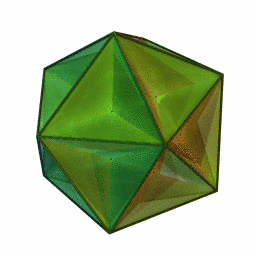

# B.F.M. UNITY & B.F.M. U.R.S.

<figure><figcaption></figcaption></figure>

<figure><figcaption>
B.F.M. UNITY
</figcaption></figure> <figure><figcaption>
B.F.M. U.R.S.
</figcaption></figure>

<figure><figcaption></figcaption></figure>

## 黃 #D0D000&#x20;

## 蒼 #3030FF

| 杠杆率：5x       | 时间调仓：3h，空间调仓：2.5% |
| ------------ | ----------------- |
| BTC          | 20%               |
| ETH          | 20%               |
| PAXG or XAUT | 20%               |
| LEO          | 20%               |
| USDT or USDC | 20%               |

| 杠杆率：4x                     | 时间调仓：3h，空间调仓：2.5% |
| -------------------------- | ----------------- |
| ETHBTCUSDT（SHORT）          | 25%               |
| ETHUSDT（LONG）              | 25%               |
| BTCUSDT（SHORT）             | 25%               |
| PAXGUSDT or XAUGUSDT（LONG） | 25%               |
