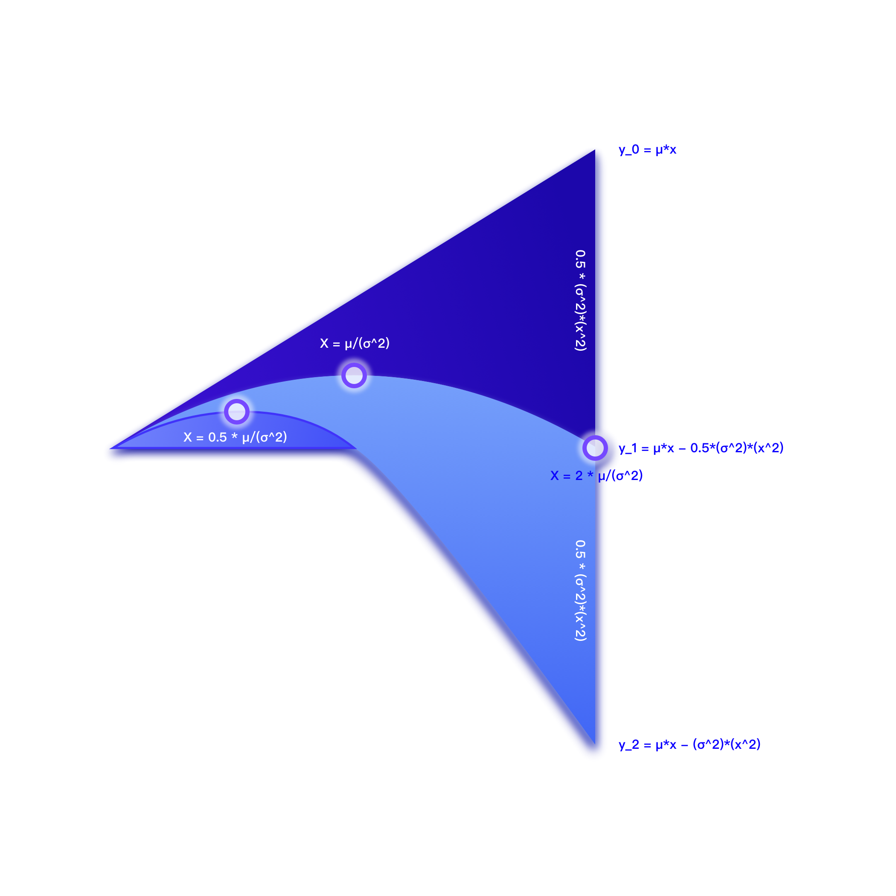

# 卓尔金升级A12——凯利准则

 

## 〇

波动率(σ)就是标准差(σ)

波动率的平方(σ^2)就是方差(σ^2)

不要和我玩文字游戏，我现在统一一下共识。

## 一

算数平均收益率(μ)

几何平均收益率 = 算数平均收益率(μ) - 0.5\*方差(σ^2)

调和平均收益率 = 算数平均收益率(μ) - 方差(σ^2)

## 二

设杠杆率为x

加杠杆的算数平均收益率 y\_0 = μ\*x

加杠杆的几何平均收益率 y\_1 = μ\*x - 0.5\*(σ^2)\*(x^2)

加杠杆的调和平均收益率 y\_2 = μ\*x - (σ^2)\*(x^2)

## 三

使得 y\_1 最大的杠杆率是 μ/(σ^2) , 使得 y\_1 归零的杠杆率是 2 \* μ/(σ^2),

使得 y\_2 最大的杠杆率是 0.5 \* μ/(σ^2) , 使得 y\_2 归零的杠杆率是 μ/(σ^2),

## 四

网格赚取的超额收益是算数平均收益率与调和平均收益率的差，

即为 (σ^2)\*(x^2)

屯币宝赚取的超额收益是算数平均收益率与几何平均收益率的差，

即为 0.5 \* (σ^2)\*(x^2)

## 五

说三个数，

0.35 以下是理性投资，

0.35 - 0.70 是感性投资，

0.70 - 1.50 是直觉投机，

1.50 以上是赌博，丧失人性。

这个杠杆率是通过夏普率和收益率算出来的。

超过 0.70，就不值得了。超过 1.40，准备亏损，超过 3.00，准备跳楼。

所以派网没有给大家更高的杠杆代币，还是有道理的。可能派网也模拟过了。

这个是我自己计算的结果，仅供参考，不构成投资建议，也不代表派网的观点。

## 六

如何实时计算推荐仓位？

未来可能会对卓尔金历法进行升级，用60天内的历史数据计算平均收益率和波动率

### 计算

一个周期内的平均收益率 μ = POWER(终值/初值,周期时段/(终时-初时))-1

一个周期内的平均波动率或标准差 σ = POWER(STDEV(各个收益率)+1,周期时段/(终时-初时))-1

一个周期内的推荐杠杆率 X = **** μ/(σ^2)

### 转换周期

(μ或σ) 切换周期 T\_1 到 T\_2 = POWER((μ或σ)+1 , 目标周期时段T\_2/原有周期时段T\_1) - 1

&#x20;X 切换周期 T\_1 到 T\_2 = **不能直接转换计算,需要先转换计算**μ和σ,再根据μ和σ重新计算X

### 设置滚动窗口选取区间

**滚动窗口不能直接选择数据，要新设滚动窗口，选择最后的编号，再根据编号选择数据**

在Excel中我们能够使用数组公式来找到行或列中的最后一个非空单元格。然后再此通过单元格的地址并使用INDIRECT函数就可以获取到此单元格的值。

excel 如何使用数组公式来找到行或列中的最后一个非空单元格 取得一列中的最后一个非空行

1、接下来的公式可以返回A列中最后一个非空单元格的行号：

\=MAX((A：A<>"")\*(ROW(A：A)))

2、通过这个行号我们就可以使用ADDRESS函数来获取到此单元格的地址：

\=ADDRESS(MAX((A：A<>"")\*(ROW(A：A)))，COLUMN(A：A))

3、最后我们以此获取到的地址为基础使用INDIRECT函数就可以获取到此单元格的值

\=INDIRECT(ADDRESS(MAX((A：A<>"")\*(ROW(A：A)))，COLUMN(A：A)))

取得一行中的最后一个非空列

1、接下来的公式和上面取得非空行的公式原理是一样的，它可以返回第一行中最后一个非空单元格的列号：

\=MAX((1：1<>"")\*(COLUMN(1：1)))

2、同理通过这个列号我们就可以使用ADDRESS函数来获取到此单元格的地址：

\=ADDRESS(1，MAX((1：1<>"")\*COLUMN(1：1))，1)

3、最后我们以此获取到的地址为基础使用INDIRECT函数就可以获取到此单元格的值

\=INDIRECT(ADDRESS(3，MAX((3：3<>"")\*COLUMN(3：3))，1))

注意：以上公式都是数组公式，所以你必须使用CTRL+SHIFT+ENTER来输入这些公式

