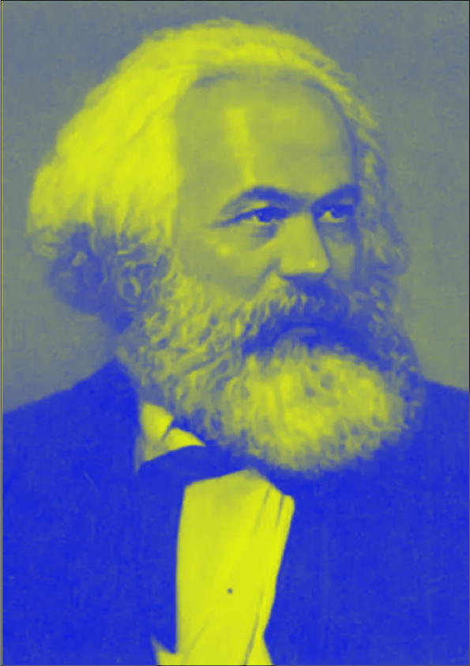
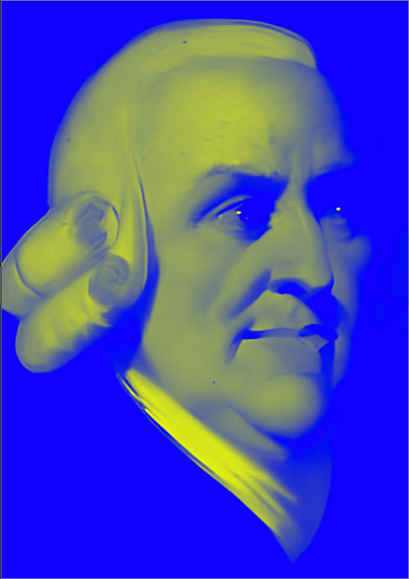
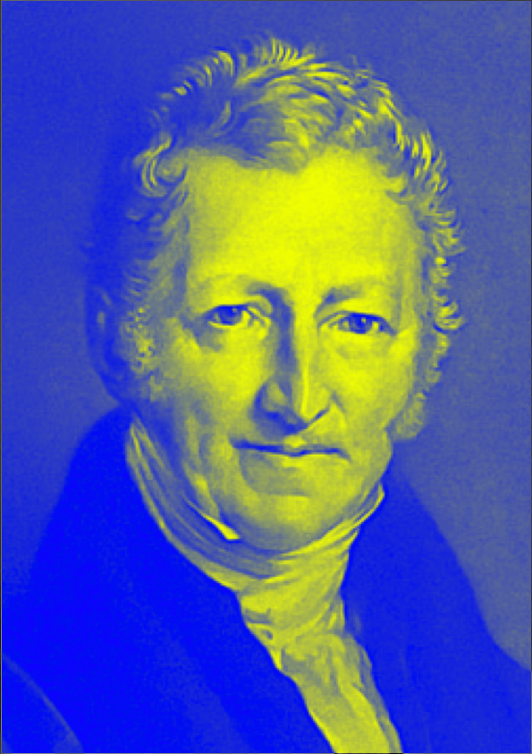
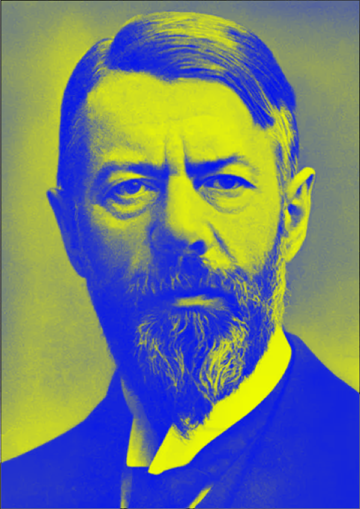
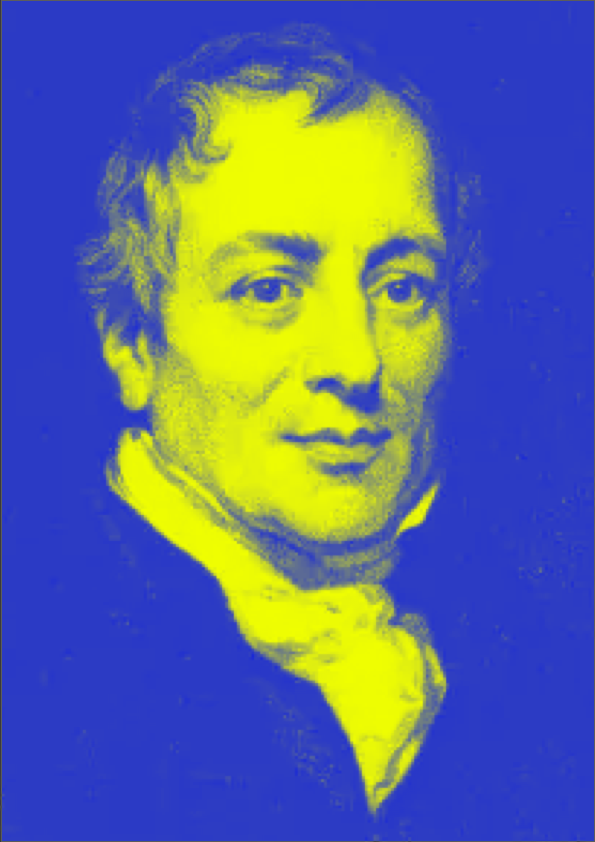
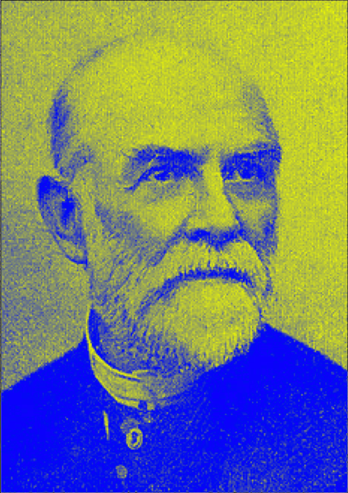
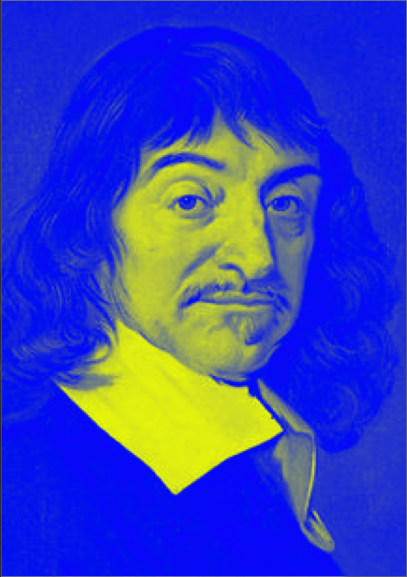
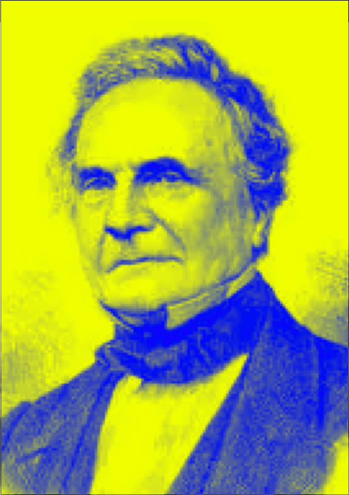

# 😇 历任行长（嵌套螺旋·符文占星·死灵炼金·原语谕示）

## 嵌旋递归

<table><thead><tr><th width="160"></th><th width="145"></th><th width="148"></th><th width="146"></th><th></th></tr></thead><tbody><tr><td></td><td></td><td></td><td></td><td></td></tr><tr><td></td><td></td><td></td><td></td><td></td></tr><tr><td></td><td></td><td></td><td></td><td></td></tr></tbody></table>

|                                                                    |                                                                                  |                                                                                                                                 |                                                                                                                                                 |                                                                                                                                   |
| ------------------------------------------------------------------ | -------------------------------------------------------------------------------- | ------------------------------------------------------------------------------------------------------------------------------- | ----------------------------------------------------------------------------------------------------------------------------------------------- | --------------------------------------------------------------------------------------------------------------------------------- |
|  | 
 
 | 
 欧拉

Leonhard Euler  1707-1783
 | 
 哈密顿

William Rowan Hamilton

1805-1865
 | 
 希尔伯特

 David Hilbert

1862-1943
 |
|                                                                    |                                                                                  |                                                                                                                                 |                                                                                                                                                 |                                                                                                                                   |
|                                                                    |                                                                                  |                                                                                                                                 |                                                                                                                                                 |                                                                                                                                   |
|                                                                    |                                                                                  |                                                                                                                                 |                                                                                                                                                 |                                                                                                                                   |
|                                                                    |                                                                                  |                                                                                                                                 |                                                                                                                                                 |                                                                                                                                   |

|                                                                         |                                                                        |                                                                          |
| ----------------------------------------------------------------------- | ---------------------------------------------------------------------- | ------------------------------------------------------------------------ |
|        |  |        |
|  |   |  |
|  |   |    |
