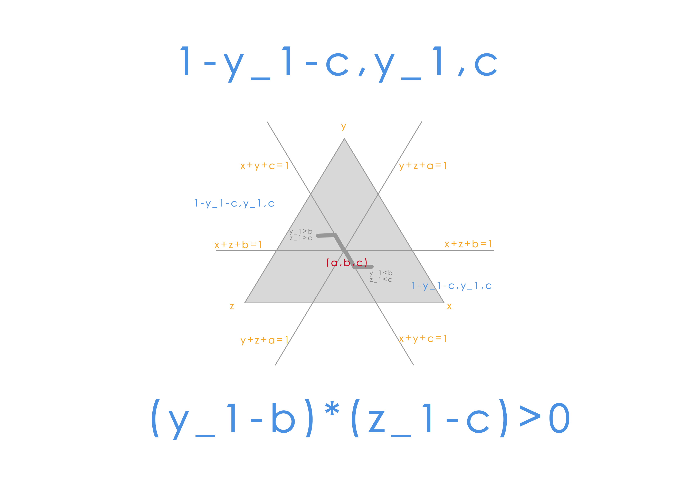

# 哈布历法1层次


[卓尔金+哈布飞船](https://share.weiyun.com/O2bZwwMx)

[卓尔金+哈布飞船(1)](https://share.weiyun.com/kqakKw4y)


所有可能的点都落在x\_1+x\_2+…+x\_n=1这个n维空间中的超平面上。

每次只能移动x\_i，x\_j两个维度上的变量，且保持其他变量不变。

求(x\_1\_0,x\_2\_0,…,x\_n\_0)到(x\_1\_m,x\_2\_m,…,x\_n\_m)之间的最短路径。

首先可以得到m=n-1

就是只能在n-1步骤之内解决此问题

另外由于每次只移动两个变量。所以每次都可以看作是一条直线和一个超平面的交点。

而且，每移动一次，这个超平面就被降维一次，直到最后被降维成0，就移动结束了。

Guhhhhaa：也许银河系只是根据一个高维空间内的最短路径产生的螺旋结构。\
若尘：哈哈，某种意义上讲你说的不错，根据相对论，万有引力下的物体总是沿着闵科夫斯基空间中的最短路径运动

