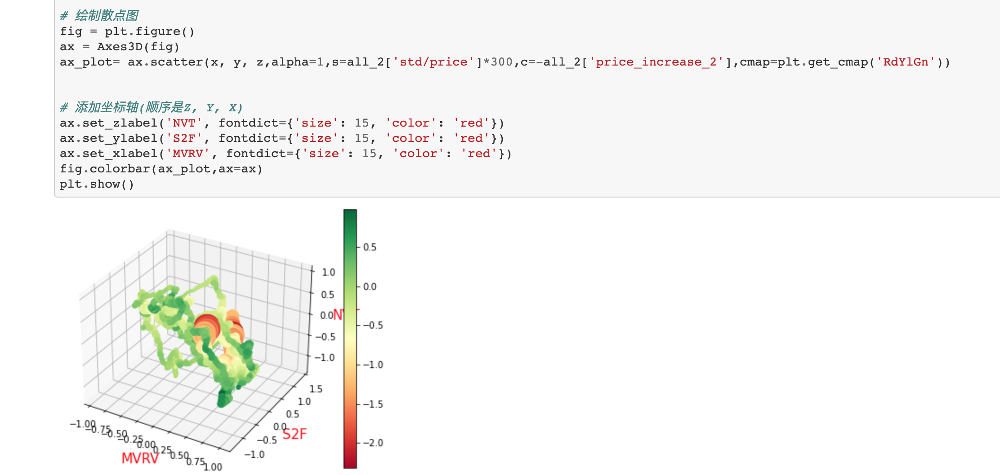
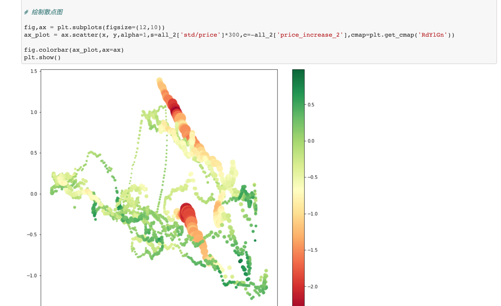

# LV6-星魔方 \(分类\) 🎲


## 问题描述

## [卓尔金历法](https://www.bfm-unity.com/qian-xian/management-cockpit-operation/zi-chan-pei-zhi/ling-hang-duo-lei-da)

我们之前所说的[卓尔金历法](https://www.bfm-unity.com/qian-xian/management-cockpit-operation/zi-chan-pei-zhi/ling-hang-duo-lei-da)，解决的是二维空间中的分类问题，

使用的方法是逻辑回归LR，使用的激活函数是sigmoid函数

二维空间，指的是 MVRV的60日均线，S2F月预测价格/价格的60日均线， 这两个变量，经过规整化，90%概率分布于（-1，1）后，构成的空间，

喂进去的训练数据是，经过数学处理，90%概率分布于（-1，2）的，基于（60天后的涨跌幅分布）的训练数据。

模型的预计输出结果是，（-1，2）的仓位控制策略模型，

这个模型被称为：[卓尔金历法](https://www.bfm-unity.com/qian-xian/management-cockpit-operation/zi-chan-pei-zhi/ling-hang-duo-lei-da)，或，二向箔。 

问题已经被Excel解决，但是不具有扩展性。

## [宇宙魔方](https://www.bfm-unity.com/qian-xian/yu-zhou-mo-fang-hui-gui-fen-xi)

我们现在这个问题属于三维空间中的，分类问题， 

使用的方法是逻辑回归LR，使用的激活函数是sigmoid函数

三维空间，指的是 MVRV的60日均线，S2F月预测价格/价格的60日均线，NVT的60日均线， 这三个变量，经过规整化，90%概率分布于（-1，1）后，构成的空间，

喂进去的训练数据是，经过数学处理，90%概率分布于（-1，2）的，基于（60天后的涨跌幅分布）的训练数据。

模型的预计输出结果是，（-1，2）的仓位控制策略模型，

这个模型被称为：[宇宙魔方](https://www.bfm-unity.com/qian-xian/yu-zhou-mo-fang-hui-gui-fen-xi)（Tesseract）

问题的模型已经建立了，解决起来就只是时间问题了。

## 使用工具

[Anaconda](https://www.anaconda.com/) \(Jupyter Notebook，Jupyter Lab，Numpy，Pandas，SciPy，TensorFlow，Keras\)还有matplotlib，差点忘了

[**TensorFlow**](https://www.tensorflow.org/)  **\|**  [**TensorBoard**](https://www.tensorflow.org/tensorboard?hl=zh-cn)  **\|**  [**TensorBoard.dev**](https://tensorboard.dev/)  **\|**  [**Google Colab**](https://colab.research.google.com/notebooks/intro.ipynb)\*\*\*\*

[**https://playground.tensorflow.org/**](https://playground.tensorflow.org/)\*\*\*\*

\*\*\*\*[**https://nbviewer.jupyter.org/**](https://nbviewer.jupyter.org/)\*\*\*\*

### 数据来源

[MVRV](https://www.qkl123.com/data/mvrv/btc)  \|  [S2F](https://www.qkl123.com/data/s2f/btc)  \|  [NVT](https://www.qkl123.com/data/nvt/btc)


## 课程学习

* [【美国微软大神的数据分析课】Pandas vs Excel](https://www.bilibili.com/video/BV1rt411y7PY)  🚩
* [python3带你玩转excel--工作党福利--（评论区附有课件和代码）](https://www.bilibili.com/video/BV1W7411G7wP)🚩
* [如何系统地学习Python 中 matplotlib, numpy, scipy, pandas？](https://www.zhihu.com/question/37180159/answer/304720890)🚩
* \*\*\*\*[**机器学习之数据的偏态分布和数据的标准化**](https://blog.csdn.net/m0_37870649/article/details/80638179)**🚩**
* [人工智能实践：Tensorflow笔记](https://www.icourse163.org/course/PKU-1002536002?tid=1452937471)🚩

## 已经实现部分代码并开源



