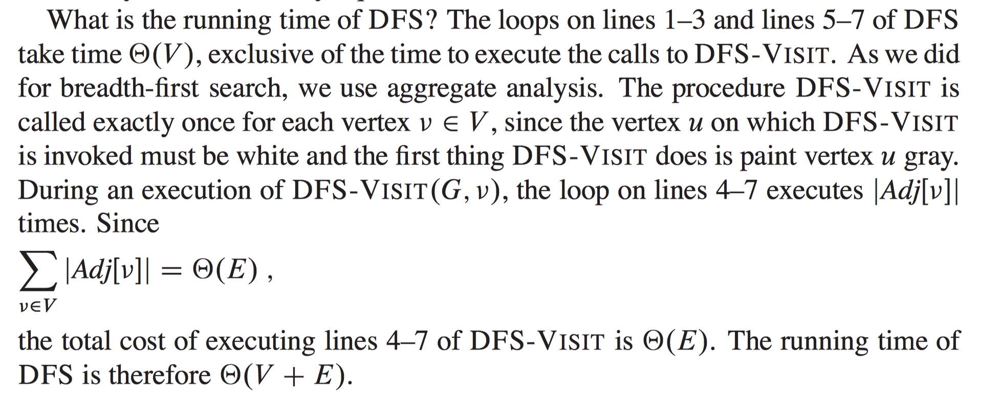
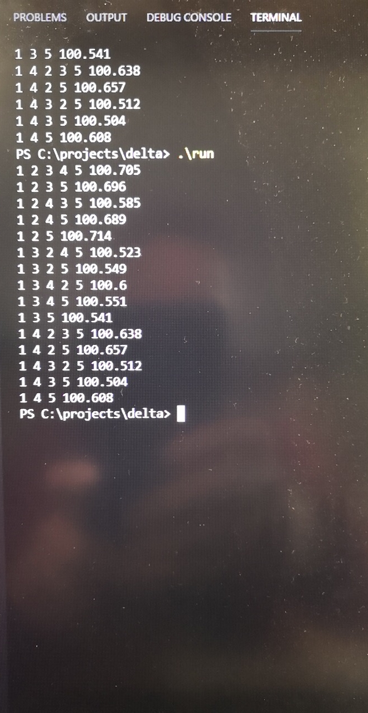
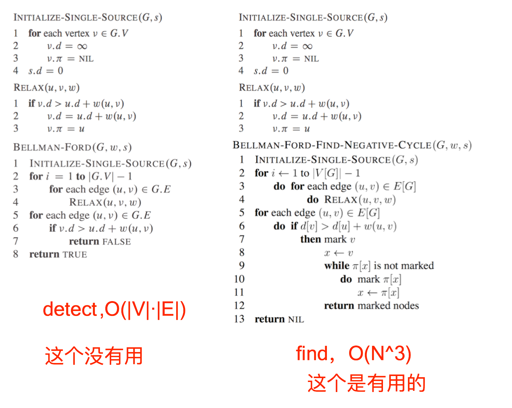

# 【参考】DFS on C++

## DFS算法介绍





《Introduction to Algorithms, 3rd Edition》可知，  
DFS算法按照临接表表示，时间复杂度是O\(V+E\)。

```csharp
DFS(G)
1 for each vertex u ∈ G.V
2     u.color = WHITE
3     u.π= NIL
4 time = 0
5 for each vertex u ∈ G.V
6     if u.color == WHITE
7         DFS-VISIT(G,u)
DFS-VISIT(G,u)
1 time = time + 1 // white vertex u has just been discovered
2 u.d = time
3 u.color = GRAY
4 for each v ∈ G.Adj[u] // explore edge (u,v)
5     if v.color == WHITE
6         v.π= u
7         DFS-VISIT(G,v)
8 u.color = BLACK // blacken u; it is finished
9 time = time + 1
10 u.f = time
```




## 若尘提供的代码\(DFS，非BFM\)

data.txt

```markup
5 1
1.000 0.741 0.657 1.061 1.005
1.349 1.000 0.888 1.433 1.366
1.521 1.126 1.000 1.614 1.538
0.942 0.698 0.619 1.000 0.953
0.995 0.732 0.650 1.049 1.000
```

fapi2.cpp

```cpp
#include<iostream>
#include<vector>
#include<fstream>

using namespace std;

int n,s;
bool avable[200];
double rate[200][200];
vector<int> path;

double exchg(double have,int u,int v)
{
    return have*rate[u][v];
}

int dfs(int p,double have)
{
    int i;
//    cout<<p<<" "<<have<<endl;
    path.push_back(p);
    if(exchg(have,p,s)>100.1)
    {
        for(i=0;i<path.size();i++)
          cout<<path[i]<<" ";
        cout<<exchg(have,p,s)<<endl;
        path.pop_back();
        avable[p]=1;
        return 1;
    }
    avable[p]=0;
    for(i=1;i<=n;i++)
        if(avable[i]) dfs(i,exchg(have,p,i));
    avable[p]=1;
    path.pop_back();
    return 0;
}

int main()
{
    ifstream fin("data.txt");
    fin>>n>>s;
    int i,j;
    for(i=1;i<=n;i++)
        for(j=1;j<=n;j++)
          fin>>rate[i][j];
    for(i=1;i<=n;i++)
        avable[i]=1;
    dfs(s,100);
    return 0;
}
```

## 运行结果



## 对若尘的专访

若尘 ：你们应当知晓 bf算法只能解决判断一个图中有无负环的问题 而不能解决找出这个负环的问题 不要再在这上面浪费时间了

Guhhhhaa：群公告，poj2240，详细讨论了这个算法。 我希望你看完之后，可以理解这个算法。 不要问我，我脑子烧坏了，已经无法理解这个算法了。

若尘：我已经会了 这个算法对你们没有用 它只能告诉你是否可能，不能告诉你该怎么做 

Guhhhhaa ：可能就干。找到一个干一个。

Guhhhhaa：我们不需要知道该怎么做——最优的，我们只需要知道能不能做——最快的。

若尘：不是最优的问题 是你们想用的算法什么也做不出来

Guhhhhaa ：POJ那个你看了吗

若尘 ：看了

Guhhhhaa ：怎么样，请评价一下

若尘 ：我要说多少遍。。 这是个存在性算法 不能求出该怎么操作

Guhhhhaa：起始点固定不就能求出来了吗。 起始点固定，找最大的环，找到一个做一个。

若尘 ：你没有理解那个算法，它就是不能求出路径，判断是否存在。

Guhhhhaa ：它不是能松弛吗，一次次松弛不就能找出来最大的了吗。

若尘 ：松弛的顺序是乱的，而且不在环上的也会被松弛， 我一开始也以为只要回溯就可以了，我已经试过了 因为只要系统里有负环，那不管从哪个节点出发总可以绕负环走很多次然后再到另一个节点，于是每个节点都是赚钱的 你无法判断负环在哪里 如果想找出负环，尽可以直接枚举 那就不关bf算法什么事了

若尘： 现在我是技术顾问，怎么解决当然得我说了算 反正你那几本书里，和算法题里的东西是解决不了这个问题的 而你的目标不是学习这个算法，而是找出套利路径 为何不采用可行的穷举法呢

若尘：我已经把程序写出来了，就按书上的数据格式，阈值千分之一收益。我检查过了，是对的 若尘：找路径又没有用，你还得获取实时汇率，还得进行交易 若尘：策略，就是你把交易所的exchange函数代入我的程序，然后在程序给出的套利圈里选一个进行交易，这就不是我应该做的事了 若尘：就一个深搜穷举

Guhhhhaa：[https://hehejun.blogspot.com/2018/05/algorithshortest-path.html](https://hehejun.blogspot.com/2018/05/algorithshortest-path.html)

最长路径问题 求一个图中的最长路径，路径可以在任意点开始，任意点终止，允许负权边。

不带权的无向无环图 等价于树的直径问题，也就是找到树的最长路径。递归或者从外向内的BFS可以解决。 递归做法：Diameter of Binary Tree 自外向内的BFS：Minimum Height Trees

不带权的有向无环图 自外向内的BFS/拓扑排序：Longest Increasing Path in a Matrix

带权的有向无环图 拓扑排序+DP

带权的无向无环图 DFS找叶子，然后再从叶子开始DFS找最长路径

普遍解法\(允许带环但不为正权环\) • 从u到v的最长路径：不能用Dijkstra，因为不满足最优子结构。对于我们维护的S，和下一个展开的节点x，完全有可能存在一条经过S之外的节点到达x的路径可能更长。而且我们也不能把边取反，Dijkstra不能应用于负权边。Bellman Ford任然是可行的，我们把边权值取反，跑BF算法找最短路径，取反之后就是对应的最长路径。多圆最长路径/任意起始终结点的最长路径: Floyd-Warshall算法仍然满足，边权值取反找多源最短路径，取反之后就是最长路径。

你用的是DFS，不是普遍解法啊。

若尘 ：不要看算法了，我不想解释，dfs怎么就不普遍了，实践出真知，你只要拿数据去试试就知道了，算法问题已经解决了，你们做接口就好

Guhhhhaa ：你没发现是无向无环图才能用DFS吗，要是有环的，不还得用取反BellmanFord吗。

```csharp
若尘 ：不是，此dfs非彼dfs，
只要把走过的路都用那个avable数组堵死，就能实现环上的dfs，
只要选取合适的exchg函数，就能实现有向图，
我向你保证，这肯定可行，你只要集中精力考虑接口就好
```

Guhhhhaa ：能具体说说怎么。 选取合适的exchg函数 吗？交易所的行情可是随时变动的，

```csharp
若尘 ：我之所以选用一个函数而不是数组，
就是考虑到还有可能有手续费的情况 
我的程序里，exchg函数暂且没有手续费，直接从rates里面读取汇率 
实时把汇率输入data.txt再调用程序，就可以得到实时的负环 
具体怎么实现，你得把交易所的情况弄清楚 
如果有的两种币不能兑换，或者单向兑换，
你只需要把exchg调成汇率为零不就好了 
exchg表示你有have钱，从u币兑换到v币时得到的钱 
具体的实现当然要根据交易所的规则来确定 
所以你要做的话，赶紧干实事
```

Guhhhhaa ：感谢若尘。

## 解释

经过我们的进一步研究，我们发现 BFM 算法有两种，其中一种是可以找到负环的。所以很遗憾，若尘没有实现 BFM 。



但他的算法的时间复杂度到底是多少？是不是O\(N^2\)？如果是O\(N^2\)当然优于BFM的O\(N^3\)，但是他说此DFS非彼DFS，所以是O\(N^2\)吗？  
我其实并没有看懂。要不读者你来看一下？

