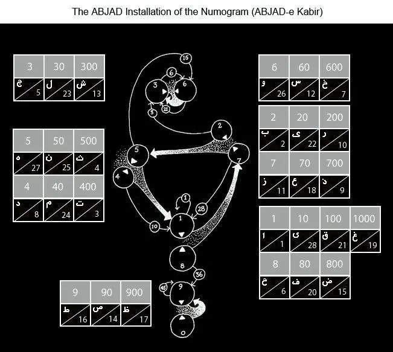
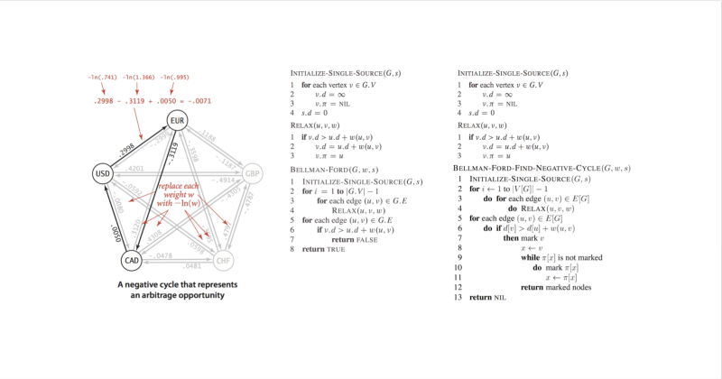

# 玩梗：论如何引起新人兴趣


本章纯属娱乐，办公人士可以跳过。

可能适合设计师，或广告行业相关人士。


## 我们使用星杯代表我们的理想

## 我们使用深渊代表我们遇到的困难

## 我们使用印钞机代表我们实现的功能

## 我们使用全视之眼代表三角套利

{% embed url="https://baike.baidu.com/item/%E5%85%A8%E7%9F%A5%E4%B9%8B%E7%9C%BC/8219624" %}

## 我们使用GOC代表多角套利和BFM算法。



## 我们使用塞拉伊诺断章代表两种算法表示



## 我们使用纳克特抄本代表对Algorithhms的汇集

{% embed url="https://baike.baidu.com/item/%E5%A5%88%E5%85%8B%E7%89%B9%E5%9F%8E/3866151" %}

## 我们使用红宝书代表Algorithhms 

Algorithhms 4th Edition by Robert Sedgewick

{% embed url="https://raw.githubusercontent.com/Mcdonoughd/CS2223/master/Books/Algorithhms%204th%20Edition%20by%20Robert%20Sedgewick%2C%20Kevin%20Wayne.pdf" %}

## 我们使用黑魔书代表Intro to Algorithms

{% embed url="https://edutechlearners.com/download/Introduction\_to\_algorithms-3rd%20Edition.pdf" %}

